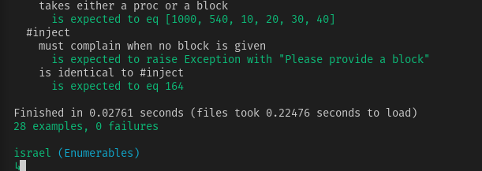

# Advanced-Building-Blocks---Enumerables
Implement a version of Ruby’s enumerable methods.

# Validations

Rubocop: 

RSpec: 

# Features

* using `/bin` and `/lib` folders to organize code
* using methods accepting a block using yield() and #call
* Basic tests on methods using `rspec`
* `module` keyword
* `requiere_relative` use for modularize the code

# Built With

* `ruby` v2.5.5+
* RVM
* `vscode` with _Ruby_ and _Rubocop_ extensions
* Linux
* Love and Passion for code.

# Author

* [Israel Laguan](https://github.com/Israel-Laguan)

# License

This project is licensed under the MIT License - see the [LICENSE.md](LICENSE.md) file for details 
