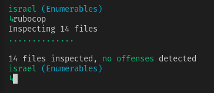
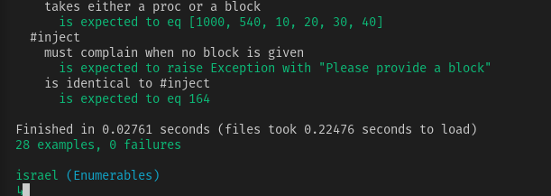

<!-- PROJECT SHIELDS -->
[![Forks][forks-shield]][forks-url]
[![Stargazers][stars-shield]][stars-url]
[![Issues-open][issues-open-shield]][issues-url]
[![Issues-closed][issues-closed-shield]][issues-url]
[![Contributors][contributors-shield]][contributors-url]
[![Framework][badge-framework]][framework-url]
[![contributions welcome][contributions-welcome]][issues-url]

<!-- PROJECT LOGO -->
 

  

  <h3 align="center">Custom Ruby Enumerables Module</h3>

  

    custom implementation of some of the methods found on the Enumerable Module in Ruby.
     
    <a href="https://github.com/Israel-Laguan/Advanced-Building-Blocks---Enumerables/blob/master/README.md"><strong>Explore the docs 📚</strong></a>
     
     
    🖊️
    <a href="https://www.theodinproject.com/courses/ruby-programming/lessons/advanced-building-blocks.">Assigment</a>
    🐞
    <a href="https://github.com/Israel-Laguan/Advanced-Building-Blocks---Enumerables/issues">Report Bug</a>
    🙋‍♂️
    <a href="https://github.com/Israel-Laguan/Advanced-Building-Blocks---Enumerables/issues">Request Feature</a>
  

# Advanced-Building-Blocks---Enumerables

This project is about implementing my own version of some of the Enumerable module methods in order to reinforce and apply ruby syntax. The methods are rebuilt based on the specs at [ruby-doc.org](https://ruby-doc.org/core-2.6.5/Enumerable.html).

You need to have Ruby installed in your computer to run this file. Also you can run it on [Repl.it](https://repl.it/), click below.

## Run Code Online

[![Run on Repl.it][badge-replit]][replit]

# Validations

Rubocop: 

RSpec: 

# Features

* using `/bin` and `/lib` folders to organize code
* using methods accepting a block using yield() and #call
* Basic tests on methods using `rspec`
* `module` keyword
* `requiere_relative` use for modularize the code
* Enumerable methods rebuilt
    + [x] [`all?`](https://ruby-doc.org/core-2.6.3/Enumerable.html#method-i-all-3F)
    + [x] [`any?`](https://ruby-doc.org/core-2.6.3/Enumerable.html#method-i-none-3F)
    + [x] [`count`](https://ruby-doc.org/core-2.6.3/Enumerable.html#method-i-none-3F)
    + [x] [`each_with_index`](https://ruby-doc.org/core-2.6.3/Enumerable.html#method-i-each_with_index)
    + [x] [`each`]()
    + [x] [`inject`](https://ruby-doc.org/core-2.6.3/Enumerable.html#method-i-inject)
    + [x] [`map`](https://ruby-doc.org/core-2.6.3/Enumerable.html#method-i-map)
    + [x] [`none?`](https://ruby-doc.org/core-2.6.3/Enumerable.html#method-i-none-3F)
    + [x] [`select`](https://ruby-doc.org/core-2.6.3/Enumerable.html#method-i-none-3F)
* Tests made with [`RSpec`](https://relishapp.com/rspec/)

# Built With

* `ruby` v2.5.5+
* RVM
* `vscode` with _Ruby_ and _Rubocop_ extensions
* Linux
* Love and Passion for code.

# Author

<table style="width:100%">
  <tr>
    <td>
        

            
            <h2>
                <a href="https://israel-laguan.github.io/" target="_blank" rel="author">
                    Israel Laguan
                </a>
            </h2>
        

    </td>
    <td>
        

            <a href="mailto:israellaguan@gmail.com" target="_blank" rel="author">
                
                <h3>
                    Email me to 
                    <a href="mailto:israellaguan@gmail.com">
                        israellaguan@gmail.com
                    </a>
                </h3>
            </a>
            <a href="https://www.linkedin.com/in/israellaguan/" target="_blank" rel="author">
                
                <h3>
                    Connect to my Linkedin
                </h3>
            </a>
            <a href="https://github.com/Israel-Laguan" target="_blank" rel="author">
                
                <h3>
                    Check my GitHub Profile
                </h3>
            </a>
        

    </td>
  </tr>
</table> 

# Contributing

[![contributions welcome][contributions-welcome]][issues-url]

🤝 Contributions, issues and feature requests are welcome!
Feel free to check the [issues page][issues-url].

# Show your support

🤗 Give a ⭐️ if you like this project!

Icons from:

<a href="https://icons8.com">Icons8</a>

# License

[![License][badge-license]](http://badges.mit-license.org)

📝 This project is licensed under the [MIT](LICENSE)\
Feel free to fork this project and improve it - see the [LICENSE.md](LICENSE.md) file for details 

<!-- MARKDOWN LINKS & IMAGES -->
[contributors-shield]: https://img.shields.io/github/contributors/Israel-Laguan/Advanced-Building-Blocks---Bubble-Sort?style=for-the-badge
[contributors-url]: https://github.com/Israel-Laguan/Advanced-Building-Blocks---Bubble-Sort/graphs/contributors
[forks-shield]: https://img.shields.io/github/forks/Israel-Laguan/Advanced-Building-Blocks---Bubble-Sort?style=for-the-badge
[forks-url]: https://github.com/Israel-Laguan/Advanced-Building-Blocks---Bubble-Sort/network/members
[stars-shield]: https://img.shields.io/github/stars/Israel-Laguan/Advanced-Building-Blocks---Bubble-Sort?style=for-the-badge
[stars-url]: https://github.com/Israel-Laguan/Advanced-Building-Blocks---Bubble-Sort/stargazers
[issues-open-shield]: https://img.shields.io/github/issues/Israel-Laguan/Advanced-Building-Blocks---Bubble-Sort?style=for-the-badge
[issues-url]: https://github.com/Israel-Laguan/Advanced-Building-Blocks---Bubble-Sort/issues
[issues-closed-shield]: https://img.shields.io/github/issues-closed/Israel-Laguan/Advanced-Building-Blocks---Bubble-Sort?style=for-the-badge
[badge-framework]: https://img.shields.io/badge/language-Ruby-red?style=for-the-badge&logo=ruby
[framework-url]: https://www.ruby-lang.org/
[contributions-welcome]: https://img.shields.io/badge/contributions-welcome-brightgreen.svg?style=for-the-badge
[badge-license]: https://img.shields.io/:license-mit-blue.svg?style=for-the-badge
[badge-replit]: https://img.shields.io/badge/Run%20on-Repl.it-lightgrey?style=for-the-badge&logo=repl.it
[replit]: https://repl.it/github/Israel-Laguan/Advanced-Building-Blocks---Enumerables